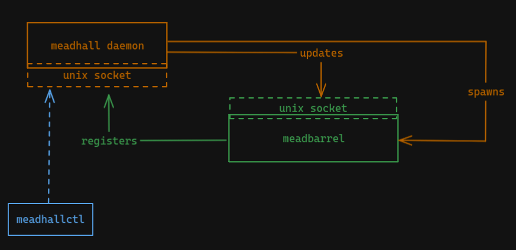

# Meadhall

Wayland desktop utilities daemon

Meadhall is a gathering place for multiple desktop utilities, such as the status bars, idle notifier, etc.

It is a daemon designed to centralize the communication with wayland and can be interfaced through the `meadhallctl` utility

## Status

Pre-alpha

## TODO

- [ ] `meadhall` (Daemon/Main Process)
    - [ ] Unix Socket
    - [ ] Systemd Unit
    - [ ] YAML configuration support
        - [ ] Individual configuration for each `$XDG_CURRENT_DEKSTOP`
            - [ ] Merge desktop-based configuration onto default one (see [`mergo`](https://github.com/darccio/mergo))
    - [ ] Wayland features
        - [x] Idle Management
        - [ ] Status Bar
        - [ ] Lock Handler
        - [ ] Output Management
            - [x] Power Management
            - [ ] Hot-plugging & Layout Management
        - [ ] Wallpaper
- [ ] `meadhallctl` (CLI interface)
    - [ ] Unix Socket communication
    - [ ] Handle arguments
    - [ ] Auto complete
- [ ] `meadbarrel` (worker processes)
    - [ ] Register itself on daemon process
    - [ ] Unix Socket

## Envisioned architecture

The intended architecture for `meadhall` consists of a main daemon process with eventual auxiliary (child) processes (aptly named `meadbarrel`)
To interface with `meadhall`, the user will be provided with a CLI utility named `meadhallctl` which will support creating one-offs or on-the-fly configurations.
Nonetheless, the main interface for configuring `meadhall` will still be the configuration file.

By default, the configuration will be read from `$XDG_CONFIG_HOME/meadhall/config.yaml`, unless there's a `$XDG_CONFIG_HOME/meadhall/$XDG_CURRENT_DEKSTOP.yaml` file. In which case, *both files will be merged*, resulting in a configuration object that is the product of the content of both files.

### Open Architecture Decisions

#### Wayland access

There are three alternatives:

1. `meadhall` is the only process actually connected to Wayland
2. `meadhall` manages a significant portion, but drawing onto the screen (i.e. status bars) is delegated to individual `meadbarrel` processes
3. `meadhall` doesn't connect to Wayland at all; instead, each Wayland feature is managed by a specialized `meadbarrel` process

### Past Architecture Decisions

This project uses [Architectural Decision Records](https://adr.github.io/) to keep track of the architecture evolution. Refer to [doc/adr/](./doc/adr/) for the list of decisions
